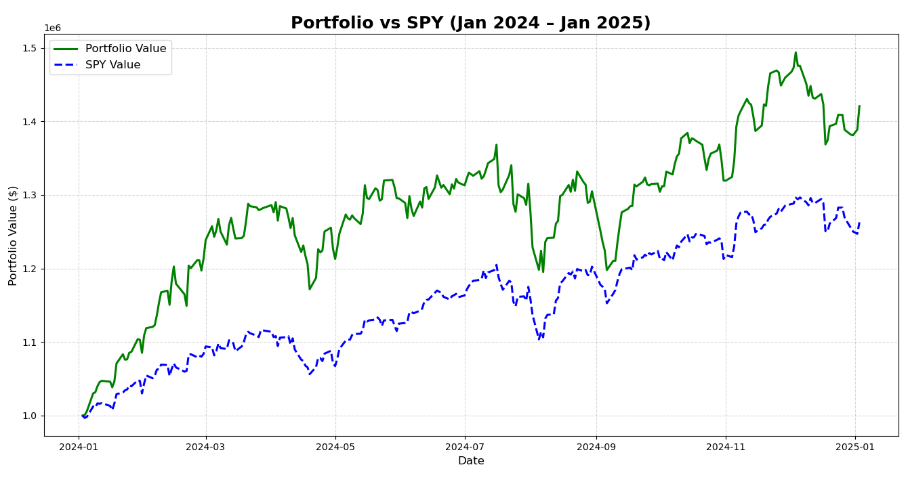
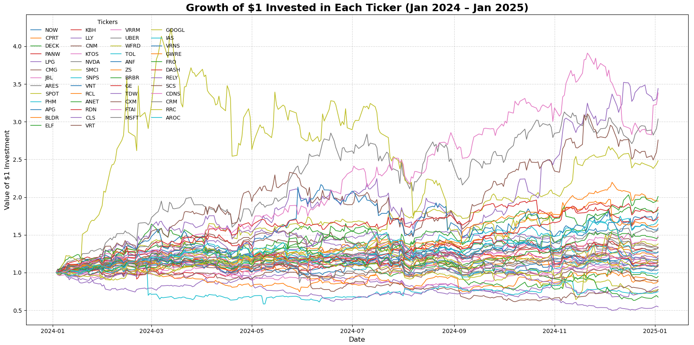

### **Momentum Strategy Backtest**

━━━━━━━━━━━━━━━━━━━━━━━━━━━━━━━━━━━━━━━━━━
---

### 🕮 **Overview**

This project explores a core hypothesis from [Alpha Architect](https://alphaarchitect.com/): that **momentum strategies** can deliver superior risk-adjusted returns by selecting stocks with strong recent performance. I chose my universe to be all common stocks and the filtering procedure was:

1. Keep the top 1500 most liquid stocks 
2. Remove stocks that have: top 10% beta (using SPY as market returns), 5% lowest 6 and 9 month returns 
3. Keep the top 100 stocks with highest returns over 2-12 month period (excluding most recent month)
4. Filter top 50 stocks with highest quality momentum (number of positive daily returns over 252 trading days / 252)
5. Hold long position for 12 months with an equally weighted portfolio
   
This is slightly different from Alpha Architect's procedure where their initial stock universe was based on a particular index (e.g. S&P500). 

Two different portfolio entry points are analyzed:

1. **January 3, 2024** — momentum strategy initiated during a broad market uptrend
2. **May 18 2024** — strategy initiated during a market reversion phase (drawdown scenario)


The benchmark is the SPDR S\&P 500 ETF Trust (SPY), used to contextualize relative performance and volatility.

━━━━━━━━━━━━━━━━━━━━━━━━━━━━━━━━━━━━━━━━━━
---

### 📐 **Strategy Motivation and Ideology**

The strategy is inspired by the quantitative research of Alpha Architect. While Alpha Architect shows that momentum is a persistent and powerful factor, they also highlight that not all winners are equal. Momentum crashes often occur when investors chase unsustainable trends or crowded trades. To mitigate this, we employ a Frog-in-the-Pan (FIP) metric to quantify the smoothness of the returns of a particular stock. The idea is that traders won't overreact to gradual changes in returns over time, allowing a stock to keep winning. In contrast, large discrete jumps in returns may cause traders to overreact and move prices down, causing a reversion. This is analgous to how a frog placed in a pan of water won't notice gradual increases in temperature, unless the water was immediately boiling. 

━━━━━━━━━━━━━━━━━━━━━━━━━━━━━━━━━━━━━━━━━━
---

### 🏗️ **Portfolio Construction**

####  **Ticker Selection**

Filtered tickers were selected based on prior momentum rankings listed in the **Overview** section. The selected tickers were saved to `portfolio_investment.csv` with their respective weights and latest prices at the entry date.

####  **Initial Capital**

\$1,000,000 equally weighted across selected stocks using the weights in `portfolio_investment.csv`.

####  **Data Source**

All price data was pulled from **Polygon.io** using the REST API with the endpoint:

```python
client.get_aggs(ticker, 1, "day", start_date, end_date)
```

━━━━━━━━━━━━━━━━━━━━━━━━━━━━━━━━━━━━━━━━━━
---

### 💵 **Backtest Results & PnL Summary**


#### **January 3, 2024 - January 3, 2025:**
 
🔸 **Cumulative Return:** `42%`

🔸 **SPY (S&P500) Benchmark:** `25% `

🔸 **Portfolio Value:** `$1,420,672`

🔸 **Sharpe Ratio:** `1.74`

🔸 **Max Drawdown** `-12.7%`

🔸 **α:** `4.7%`

🔸 **β:** `1.26`

<p align="center">
  
</p>
<p align="center">
  <em>Figure 1.1: Portfolio vs SPY Returns (Jan 2024–Jan 2025)</em>
</p>

<p align="center">
  
</p>
<p align="center">
  <em>Figure 1.2: Individual returns of stocks within our portfolio (Jan 2024–Jan 2025)</em>
</p>

The portfolio returned 42% over the year, outperforming the S&P 500 by 17 percentage points (fig. 1.1). With a Sharpe ratio of 1.74 and a beta of 1.26, the strategy demonstrated strong risk-adjusted performance despite higher volatility. An alpha of 4.7% indicates that the portfolio exceeded expected returns based on market exposure, highlighting a meaningful edge. The volatility of the strategy is reflected in the amplified fluctuations relative to SPY, as the portfolio intentionally takes on greater systematic and idiosyncratic risk in pursuit of outperformance. Furthermore, the individual stock return plot (fig 1.2) shows that several holdings posted substantial gains. This reflects the benefits of being exposed to non-systematic risks. These extreme winners, which would be diluted in a market index, played a key role in driving overall portfolio alpha.

This strategy exhibits a short-term reversions—visible in temporary divergence between portfolio and SPY returns near August—the momentum reasserts itself shortly afterward. However, this highlights an important risk: the strategy remains vulnerable to initiating positions just before a reversal, as illustrated by the drawdown following the May 18, 2024 entry point.


#### **May 18, 2024 - May 18, 2025:**
 
🔹 **Cumulative Return:** `21%`

🔹 **SPY (S&P500) Benchmark:** `11% `

🔹 **Portfolio Value:** `$1,213,182`

🔹 **Sharpe Ratio:** `1.74`

🔹 **Max Drawdown** `-31%`

🔹 **α:** `8.6%`

🔹 **β:** `1.41`
  
<p align="center">
  
</p>
<p align="center">
  <em>Figure 2.1: Portfolio vs SPY Returns (May 2024–May 2025)</em>
</p>

<p align="center">
  
</p>
<p align="center">
  <em>Figure 2.2: Individual returns of stocks within our portfolio (May 2024–May 2025)</em>
</p>

The portfolio returned 21%, outperforming the S&P 500 benchmark by 10 percentage points. With a Sharpe ratio of 1.74 and a beta of 1.41, the strategy again demonstrated strong market-adjusted returns. However, the higher alpha of 8.6% came with significantly greater exposure to both systematic and non-systematic risk. This is evident in the steep -31% drawdown, which highlights how volatile the path to outperformance can be. Despite selecting stocks with previously strong and steady momentum, the portfolio experienced an immediate reversion after entry. This suggests the inherent danger of chasing performance just as it begins to fade — a common pitfall in momentum strategies. Though the portfolio ultimately recovered and delivered positive returns by the end of the year, the recovery was much more volatile than the initial leg up, underscoring the fragility of alpha when timing misaligns with regime shifts. It would be natural to try to use volatility as an indicator for such events, however reversions occurred even in low volatility regimes, which agrees with the implications of the Alpha Architect article. 

Still, the individual return chart clearly shows that a handful of names experienced outsized gains over the holding period. These high-performing outliers exemplify the upside of embracing idiosyncratic risk — providing profit opportunities that broad, diversified index strategies would have largely missed or diluted away.

━━━━━━━━━━━━━━━━━━━━━━━━━━━━━━━━━━━━━━━━━━
---

### 📊 **Feature Correlation**

As a quick exploratory step, I tested whether any initial filtering metrics (e.g. beta, recent returns) correlated with the final returns of stocks in the January backtest. The results showed no strong linear relationship between any single feature and future performance. There was some correlation between 2m_returns (2-12 month returns) and 9/6 month returns; however, it is not insightful as a potential early reversion signal. This suggests that simple correlations are not reliable predictors in this context, and reinforces the importance of timing and portfolio-level construction. *Note a typo in the plot title—it should say "Final 12 month return" not 9 month.*


━━━━━━━━━━━━━━━━━━━━━━━━━━━━━━━━━━━━━━━━━━
---

### 🔑 **Key Takeaways**

* **Momentum works, but timing matters:**
Both portfolios outperformed the S&P 500 and delivered positive alpha, but their outcomes varied significantly depending on market conditions at the entry date. Entering into strength (January 3) led to smoother outperformance, while entering during a potential regime shift (May 18) resulted in a sharp drawdown before recovery.

- **Larger Alpha ≠ Better:**  
  The May 18 portfolio had a higher alpha (`8.6%`) than the January 3 portfolio (`4.7%`), but this came with a significantly larger max drawdown (`-31%` vs. `-12.7%`) and a higher beta (`1.41`). While alpha represents market-adjusted outperformance, it doesn't account for the path taken to get there. A higher alpha can still come with more risk, volatility, or poor timing — making the strategy harder to stick with, and not necessarily “better” in practice.


* **Alpha is a double-edged sword:**
The individual return charts highlight the trade-off: while many stocks closely tracked the index, a few produced explosive gains that powered the portfolio’s performance. These outliers showcase the upside of concentrated momentum strategies. However, this also means the portfolio is more sensitive to stock-specific reversals.

* **Momentum can fail short-term despite strong signals:**
Both portfolios were constructed using high-quality momentum filters, yet the May 18 portfolio faced immediate underperformance. This underscores a key risk in momentum strategies: strong past performance is no guarantee of continued outperformance, especially near inflection points or during market transitions.

* **Alpha Architect's warnings hold true:**
These backtests illustrate Alpha Architect’s core point: momentum can outperform in the long run, but requires behavioral discipline to endure periods of painful reversion and volatility. Investors seeking alpha through concentrated factor exposures must be prepared for drawdowns and stick to the process.

━━━━━━━━━━━━━━━━━━━━━━━━━━━━━━━━━━━━━━━━━━
---

### 📈 **Future Improvements**

* **Reversion Detection & Exit Timing:**
I experimented with RSI-based exit signals to avoid reversals, but they often cut profitable trends too early and added noise. Future iterations could explore more reliable reversion filters, such as volatility spikes, momentum flattening, or rolling z-score decay to improve exit timing without suppressing upside.

* **Rebalancing Logic & Timing Risk:**
While Alpha Architect notes that quarterly rebalancing tends to maximize long-term performance, I didn’t see conclusive benefits in my backtests. In fact, quarterly rebalancing often reduced profits, as new stock selections occasionally entered into reversion phases due to unfortunate timing. Future improvements could include staggered entries or rolling rebalancing windows to smooth exposure and reduce this risk.

* **Sector- and Size-Based Filtering:**
Applying momentum selection within sectors or across market cap tiers may improve risk control and help isolate true relative strength winners, while reducing systemic exposure to macro or industry-wide swings.

* **Conviction-Weighted Positioning:**
Rather than equal weighting, future portfolios could assign weights based on momentum quality, FIP scores, or volatility-adjusted returns, concentrating capital in higher-confidence positions and improving capital efficiency.

━━━━━━━━━━━━━━━━━━━━━━━━━━━━━━━━━━━━━━━━━━
---


 ### 📂 **Script Information**
 
| File                             | Description                                                                                                 |
| -------------------------------- | ----------------------------------------------------------------------------------------------------------- |
| `0_fetch_stock_universe.py`      | Fetches all active U.S. common stock tickers from the Polygon API.                                          |
| `1_filter-top-1500-liquidity.py` | Computes average daily volume and selects the top 1500 most liquid stocks.                                  |
| `2_3_filter-outliers.py`         | Calculates beta vs. SPY and multi-period momentum features; filters out high-beta and weak momentum stocks. |
| `4_filter-momentum-quality.py`   | Scores momentum smoothness using the Frog-in-the-Pan (FIP) metric and selects the top 50 stocks.            |
| `5_portfolio-weighting.py`       | Allocates equal weights across the selected stocks and calculates share allocations based on latest prices. |
| `6_backtest.py`                  | Runs the backtest, computes portfolio performance vs. SPY, and generates performance plots and CSV exports. |
| `constants.py`                   | Centralized file for global constants such as `ENTRY_DATE`, `EXIT_DATE`, and `API_KEY`.                     |


━━━━━━━━━━━━━━━━━━━━━━━━━━━━━━━━━━━━━━━━━━
---

### 📝 **References**

* [Alpha Architect Blog](https://alphaarchitect.com/): Inspiration for momentum ranking logic
* [Polygon.io API Docs](https://polygon.io/docs/)
* [RSI - Investopedia](https://www.investopedia.com/terms/r/rsi.asp)
* Jegadeesh & Titman (1993): "Returns to Buying Winners and Selling Losers"


━━━━━━━━━━━━━━━━━━━━━━━━━━━━━━━━━━━━━━━━━━
---

### **Contact**

If you'd like to discuss or extend this project, feel free to reach out or open an issue! ctbowler@outlook.com
