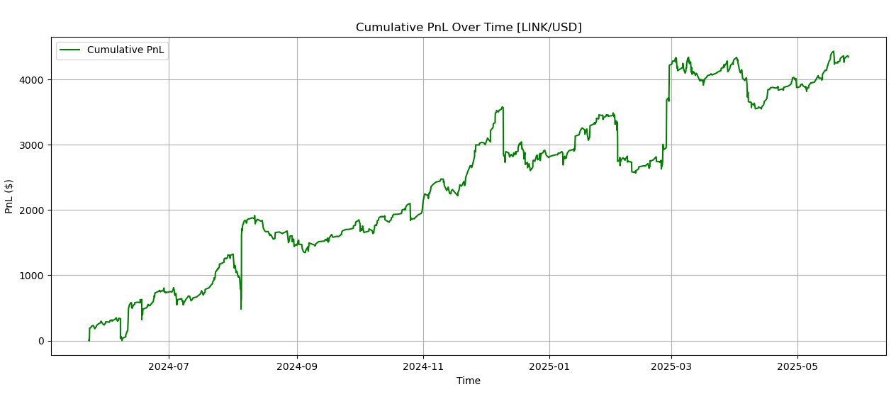
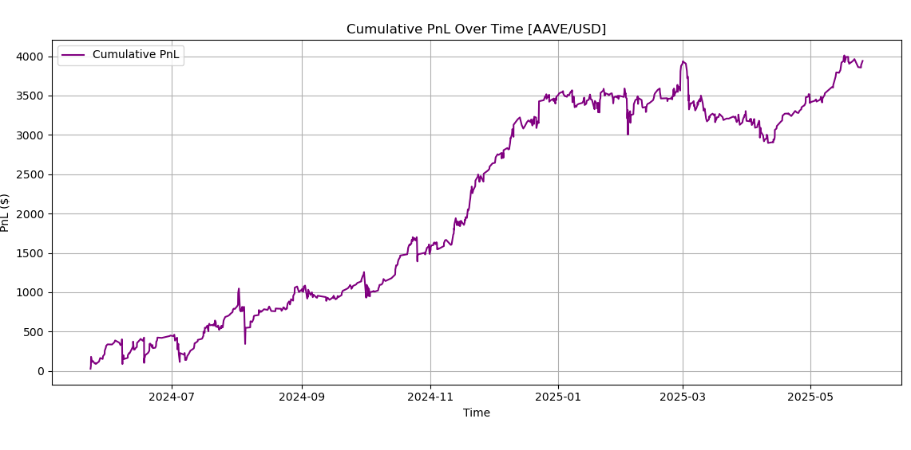
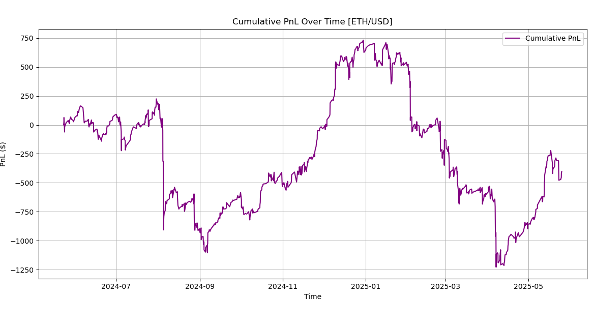

# 🔁 Crypto Kalman Filter Mean Reversion Strategy

━━━━━━━━━━━━━━━━━━━━━━━━━━━━━━━━━━━━━━━━━━  
---

### 🕮 **Overview**

This project implements a **Kalman filter-based mean reversion strategy** applied to cryptocurrencies. Inspired by statistical arbitrage techniques used in equities, the goal is to identify short-term undervaluation of an asset relative to its dynamically estimated fair value and capture returns as it reverts back.

The strategy is applied to **single assets**, not pairs, using:

- **Kalman Filter** to estimate an adaptive price mean,  
- **Z-score of price deviations** from the mean to trigger trades,  
- **RSI filtering** to reduce trades during strong downward momentum,
- **$5000** portfolio value.
- **Stop-loss logic** to contain adverse moves. A maximum of 5% of our portfolio is risked.

Both **backtests** and **live paper trading simulations** are included. The strategy was run over **1/03/2024 - 04/03/2024**.

━━━━━━━━━━━━━━━━━━━━━━━━━━━━━━━━━━━━━━━━━━  
---

### 📐 **Strategy Motivation and Design**

Traditional mean reversion strategies rely on fixed moving averages or Bollinger Bands. This project explores a **Kalman filter** approach — a recursive algorithm that continuously estimates a latent state (in this case, a price mean) based on noisy observations.

By combining the Kalman filter with a **rolling z-score** and **RSI momentum filter**, this strategy attempts to isolate statistically significant price dips that are also oversold, offering high-probability bounce scenarios.

>  Entry occurs when price is far below the Kalman mean (z-score < –1) **and** RSI < 30.  
>  Exit is triggered when price reverts to mean (sufficiently low z-score) **or** drawdown exceeds 5%.

━━━━━━━━━━━━━━━━━━━━━━━━━━━━━━━━━━━━━━━━━━  
---

### 🧪 **Workflow**

1. **Filter Top Liquid Coins**  
   - Uses Alpaca's historical crypto data to compute dollar volume.  
   - Keeps top 20 most liquid coins over a 4-month lookback.  
   - Outliers with extreme volatility or data gaps are dropped.

2. **Backtest Kalman Strategy on Each Coin**  
   - Run `mean_reversion.py` to simulate the Kalman-RSI strategy over historical prices.  
   - Use grid search to tune hyperparameters (Q, R, z-threshold, RSI).  
   - Evaluate by Sharpe Ratio, Return %, and PnL.

3. **Live Paper Trading via Alpaca**  
   - Price data from **Binance** (5-minute candles)  
   - Trade execution via **Alpaca** paper account  
   - Order logic uses limit buys and market exits  
   - Trade logs and PnL stored in local CSVs
   - As of now, paper trader is not running due to the lack of liquidity on Alpaca's exchange. I am working on moving this process to coinbase.

━━━━━━━━━━━━━━━━━━━━━━━━━━━━━━━━━━━━━━━━━━  
---

### 💻 **Codebase Overview**

| File                     | Description |
|--------------------------|-------------|
| `filter_liquidity.py`    | Filters top coins by 4-month average dollar volume from Alpaca API |
| `mean_reversion.py`      | Kalman mean estimator + backtester with z-score/RSI entry and stop-loss exits |
| `paper_trader.py`        | Real-time Alpaca trader using Binance prices and Alpaca order placement |
| `constants.py`           | Centralizes date, API keys, and global parameters for filtering and backtests |

━━━━━━━━━━━━━━━━━━━━━━━━━━━━━━━━━━━━━━━━━━  
---

### 📊 **Backtest Results (Top Coins by Sharpe)**

Test Period: `Jan 3, 2024` — `Apr 3, 2024`  
Capital per coin: `$5,000`  

| Coin | Sharpe Ratio | Return % | Trades |
|------|--------------|----------|--------|
| LTC  | **1.58**     | 23.4%    | 9      |
| AAVE | **1.38**     | 18.7%    | 7      |
| LINK | 1.13         | 16.4%    | 6      |
| DOGE | 0.47         | 5.1%     | 4      |
| ETH  | -0.15        | -2.9%    | 2      |

Each asset was backtested individually using a Kalman filter with optimized Q/R noise parameters, z-score entry threshold, and RSI confirmation filter. Trades were taken when the price dipped significantly below its dynamic mean and momentum confirmed oversold conditions. Here's a detailed look at the performance:

---

#### 🔵 **LTC/USD**  
**Sharpe Ratio:** 1.58  
**Total PnL:** ~$5,000  
**Observations:**  
LTC delivered the most consistent reversion behavior across the backtest window. The price frequently reverted toward the Kalman mean after downward deviations, with very few false positives. This asset demonstrated **high signal clarity**, making it ideal for a mean-reversion strategy.

<p align="center">
  <br>
  <em>Figure: Cumulative PnL for LTC/USD</em>
</p>

---

#### 🟢 **LINK/USD**  
**Sharpe Ratio:** 1.13  
**Total PnL:** ~$4,400  
**Observations:**  
LINK had strong directional swings but still showed periodic reversion behavior. While there were occasional drawdowns, the asset frequently returned to its estimated mean in a **predictable, stepwise pattern**. Some noisy segments did impact PnL, but overall momentum reversals aligned well with Kalman z-scores and RSI confirmation.

<p align="center">
  <br>
  <em>Figure: Cumulative PnL for LINK/USD</em>
</p>

---

#### 🟣 **AAVE/USD**  
**Sharpe Ratio:** 1.38  
**Total PnL:** ~$4,000  
**Observations:**  
AAVE behaved similarly to LTC — showing **clear oscillations around the Kalman mean** with strong recovery after drawdowns. The main difference was more clustering of flat returns mid-strategy, which reduced trade frequency, but did not materially degrade performance.

<p align="center">
  <br>
  <em>Figure: Cumulative PnL for AAVE/USD</em>
</p>

---

#### 🔻 **ETH/USD**  
**Sharpe Ratio:** –0.153  
**Total PnL:** ~–$1,000  
**Observations:**  
ETH consistently underperformed. Despite brief periods of profitable reversion, most trades were taken **against prevailing market trends**. ETH’s **strong correlation with the broader market** causes it to trend during bull or bear cycles, which breaks the assumptions of mean reversion. This resulted in entries during prolonged rallies or crashes where price never reverted to the local mean.

<p align="center">
  <br>
  <em>Figure: Cumulative PnL for ETH/USD</em>
</p>

📉 **Takeaway:** Kalman filters assume stationarity around a drifting mean — ETH's behavior violated that by maintaining long directional trends.

---

#### 🟠 **DOGE/USD**  
**Sharpe Ratio:** 0.47  
**Total PnL:** ~$1,700  
**Observations:**  
DOGE's performance was highly erratic. The coin frequently overshot its Kalman mean, then reversed violently. This **ultra-high volatility** made it difficult for the strategy to determine statistically sound entries. The strategy managed to stay positive, but sharp whipsaws made most profits **fragile and temporary**.

<p align="center">
  <br>
  <em>Figure: Cumulative PnL for DOGE/USD</em>
</p>

---

### 📌 Key Observations
- High performers (LTC, AAVE, LINK) exhibited **frequent, clean oscillations** around the Kalman mean — ideal for reversion strategies.
- Poor performers like ETH and DOGE often **trended through** the estimated mean or **whipsawed** violently, producing false signals.
- RSI helped avoid entries during strong downward momentum, improving risk control.
- Next time I want to include permutation tests and refined grid search optimization for more parameters (e.g. rolling mean window, etc.)

━━━━━━━━━━━━━━━━━━━━━━━━━━━━━━━━━━━━━━━━━━  
---

### 🧠 **Kalman Filter Logic**

The Kalman filter recursively estimates a latent price mean:

```math
μₜ = μₜ₋₁ + Kₜ(pₜ − μₜ₋₁),  
Kₜ = Pₜ / (Pₜ + R),  
Pₜ = (1 − Kₜ)Pₜ + Q
