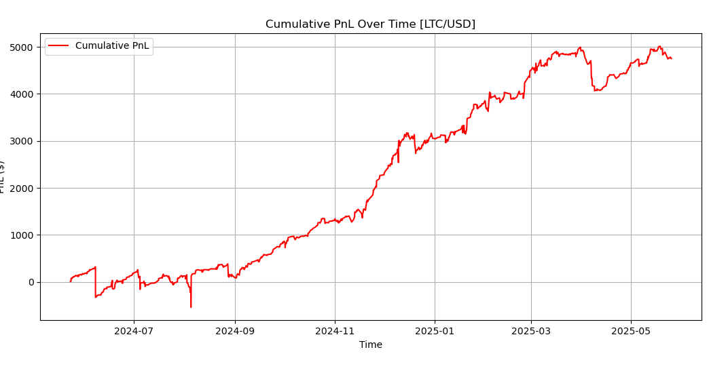

### 📊 **Results & Discussion**

Each asset was backtested individually using a Kalman filter with optimized Q/R noise parameters, z-score entry threshold, and RSI confirmation filter. Trades were taken when the price dipped significantly below its dynamic mean and momentum confirmed oversold conditions. Here's a detailed look at the performance:

---

#### 🔵 **LTC/USD**  
**Sharpe Ratio:** 1.58  
**Total PnL:** ~$5,000  
**Observations:**  
LTC delivered the most consistent reversion behavior across the backtest window. The price frequently reverted toward the Kalman mean after downward deviations, with very few false positives. This asset demonstrated **high signal clarity**, making it ideal for a mean-reversion strategy.

   
  <em>Figure: Cumulative PnL for LTC/USD</em>

---

#### 🟢 **LINK/USD**  
**Sharpe Ratio:** 1.13  
**Total PnL:** ~$4,400  
**Observations:**  
LINK had strong directional swings but still showed periodic reversion behavior. While there were occasional drawdowns, the asset frequently returned to its estimated mean in a **predictable, stepwise pattern**. Some noisy segments did impact PnL, but overall momentum reversals aligned well with Kalman z-scores and RSI confirmation.

   
  <em>Figure: Cumulative PnL for LINK/USD</em>

---

#### 🟣 **AAVE/USD**  
**Sharpe Ratio:** 1.38  
**Total PnL:** ~$4,000  
**Observations:**  
AAVE behaved similarly to LTC — showing **clear oscillations around the Kalman mean** with strong recovery after drawdowns. The main difference was more clustering of flat returns mid-strategy, which reduced trade frequency, but did not materially degrade performance.

   
  <em>Figure: Cumulative PnL for AAVE/USD</em>

---

#### 🔻 **ETH/USD**  
**Sharpe Ratio:** –0.153  
**Total PnL:** ~–$1,000  
**Observations:**  
ETH consistently underperformed. Despite brief periods of profitable reversion, most trades were taken **against prevailing market trends**. ETH’s **strong correlation with the broader market** causes it to trend during bull or bear cycles, which breaks the assumptions of mean reversion. This resulted in entries during prolonged rallies or crashes where price never reverted to the local mean.

   
  <em>Figure: Cumulative PnL for ETH/USD</em>

📉 **Takeaway:** Kalman filters assume stationarity around a drifting mean — ETH's behavior violated that by maintaining long directional trends.

---

#### 🟠 **DOGE/USD**  
**Sharpe Ratio:** 0.47  
**Total PnL:** ~$1,700  
**Observations:**  
DOGE's performance was highly erratic. The coin frequently overshot its Kalman mean, then reversed violently. This **ultra-high volatility** made it difficult for the strategy to determine statistically sound entries. The strategy managed to stay positive, but sharp whipsaws made most profits **fragile and temporary**.

   
  <em>Figure: Cumulative PnL for DOGE/USD</em>

---

### 🧠 Summary Insights

- **Best performers (LTC, AAVE, LINK)**: Showed frequent and smooth oscillations around the Kalman mean, allowing clean entry and exit points.
- **ETH**: Long market trends diluted entry signals. High beta made it unsuitable for mean reversion unless combined with market-neutral hedging.
- **DOGE**: Extreme volatility led to unstable signal interpretation and frequent stop-outs or unpredictable reversions.

Future iterations can explore **volatility filtering**, **trend regime detection**, or **multi-signal confirmation** to further refine performance across unstable assets like DOGE or market-dominant ones like ETH.
