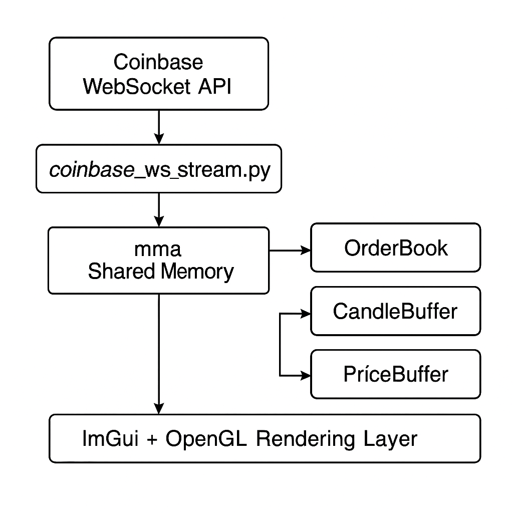

# C++ Crypto Trading Engine (Coinbase Real-Time GUI)

A real-time crypto trading engine and visualizer built in modern C++20, powered by Coinbase Advanced WebSocket data. This project features a custom order book engine, low-latency rendering with ImGui + OpenGL, and a modular design optimized for performance and extensibility. The goal was to give myself an easy way to trade on coinbase without the hassle of navigating through their UI. I wanted features like a programmable candlestick chart and L2 order book updates at my own tick rate, which aren’t accessible from Coinbase’s standard UI. 

<em>Live order book depth visualization currently showing Bitcoin through Alpaca's exchange. The tick rate is set to 10 ms, which was the smallest tick rate provided by the websocket data. </em>

  

---

## Features

- **Real-time order book depth and trade flow**
- **High-performance GUI** built with ImGui + OpenGL
- **Shared memory interface** between Python and C++ for real-time data
- **Modular C++ architecture** with extensible buffers, multi-threading, and rendering layers

---

## Data Flow Optimization
To achieve low-latency data transfer between the Python WebSocket client and the C++ trading engine, this system uses **memory-mapped shared memory (mmap)** as the communication layer. The Python streamer receives market data from the Coinbase Advanced WebSocket API, encodes it into **binary-packed structs**, and writes it directly to operating system's shared memory.

On the C++ side, a SharedMemoryReader thread continuously reads from this buffer, decoding the byte stream into structured messages (OrderBook, Trade, etc.) without the overhead of sockets or file I/O — on average my *raw* data per socket request was 4x smaller than its json equivalent, hence initializing static containers with pre-set sizes can reduce json overhead. This architecture enables real-time data flow and rendering with minimal delay, making it optimal for high-frequency market visualization and strategy simulation. 

The trades and orderbook updates are stored in circular data structures called circular queues (I refer to them as buffers e.g. PriceBuffer, CandleBuffer). These circular queues can be accessed and mutated in constant time as opposted to dynamic sized arrays or vectors, which have O(n) worst-case complexity for many of the operations required for data management. 

<em>Circular queue visual provided by https://medium.com/data-science/circular-queue-or-ring-buffer-92c7b0193326 </em>

**Note** that latency is throttled by Python's overhead for websocket requests, which happens to be on the order of milliseconds. Infact, Python's websocket libraries typically perform worse in comparison to languages like C++ (see: *"An Analysis of the Performance of WebSockets in Various Programming Languages and Libraries" (2021)* and also *Daniel Lemire’s Blog: “A Simple WebSocket Benchmark in Python” (2023)*). Therefore, the engine can be improved for HFT execution < 1ms using a C++ websocket framework, provided that the API endpoint can send updates fast enough. The smallest tick rate from the coinbase endpoint appeared to be 10ms between orderbook updates. Thus, the speed of this engine is constrained by the websocket endpoint rather than the interface itself. 

---

## Performance-Oriented Design

| Component         | Optimization Highlights                                                                 |
|------------------|------------------------------------------------------------------------------------------|
| **OrderBook**     | Custom data structure for fast bid/ask updates and market/limit order simulation        |
| **PriceBuffer**   | Rolling buffer for tick-level prices, supports real-time fade smoothing and glow effects |
| **CandleBuffer**  | Efficient OHLC aggregation with real-time partial candle updates                        |
| **Shared Memory** | `mmap` between Python and C++ for low-overhead, non-blocking interprocess communication |
| **Threading**     | Background worker threads for memory reads, orderbook parsing, and GUI refresh          |

---

## Dependencies

- C++20 compiler
- CMake 3.16+
- [GLFW](https://www.glfw.org/)
- [ImGui](https://github.com/ocornut/imgui) (include core files and backends)
- Python 3.8+
  - `websocket-client` or `aiohttp`

> ⚠️ Note: This project does **not** include ImGui or GLFW — you must install or link them manually.

---

## Purpose and Future Development
This system was built for research and performance benchmarking in real-time trading infrastructure. It is currently a work-in-progress and it's structured for future expansion, including:
- Strategy plugin support (market making, mean reversion, arbitrage)
- Simulated order execution with conversion tracking
- UI enhancements for zoom, multi-asset display, and toggles
- Possible integration with live trading APIs (e.g., Alpaca or Coinbase Advanced)

